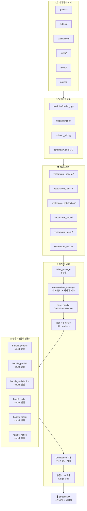
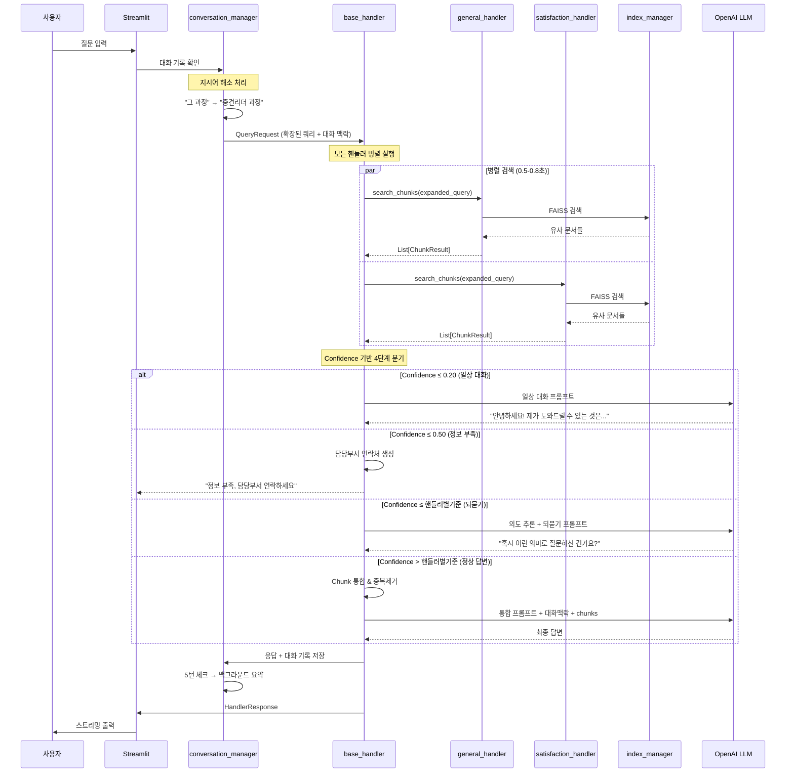

# BYEOLI_TALK_AT_GNHRD_app Architecture v3.0 (최종 완성본)

## 개요

경상남도인재개발원용 RAG 기반 대화형 챗봇으로, 챗봇의 이름은 "벼리(Byeoli)"이며, 다양한 내부 문서(교육계획, 만족도 조사, 학칙, 공지사항 등)를 기반으로 **인간 친화적 대화형 질의응답 서비스**를 제공합니다.

**핵심 설계 원칙**: 
- 모든 핸들러 병렬 실행 → chunk 수집 → 통합 LLM 호출
- **대화 맥락 유지** (5턴 슬라이딩 윈도우 + 백그라운드 요약)
- **지시어 해소** (자연스러운 대화)
- **Confidence 기반 4단계 분기** (일상 대화 + 되묻기)
- **단어 단위 스트리밍**

## 전체 아키텍처



## 핵심 설계 변경점

### ❌ 기존 방식 (제거됨)
- Router 기반 핸들러 선택
- Top-2 핸들러만 실행
- 각 핸들러가 독립적으로 LLM 호출
- 단발성 질의응답 (대화 맥락 없음)
- 복잡한 context_manager.py

### ✅ 새로운 방식 (v3.0)
- **모든 핸들러 병렬 실행**: 6개 핸들러 동시 검색
- **Chunk 수집 방식**: 각 핸들러는 검색만 담당, LLM 호출 없음
- **통합 LLM 호출**: CentralOrchestrator에서 1회만 호출
- **대화형 시스템**: 5턴 슬라이딩 윈도우 + 백그라운드 요약
- **인간 친화적**: 지시어 해소 + confidence 기반 4단계 분기
- **단일 모듈**: conversation_manager.py로 대화 관리 통합

## 데이터 구조

### ChunkResult 정의
```python
@dataclass
class ChunkResult:
    chunk: TextChunk           # 텍스트 청크 내용
    confidence: float          # 유사도 점수 (0.0-1.0)
    domain: str                # 도메인명 (satisfaction, general, etc.)
    search_method: str = "faiss"  # 검색 방법
    metadata: Dict[str, Any] = field(default_factory=dict)  # 확장 정보
```

### ConversationTurn 정의
```python
@dataclass
class ConversationTurn:
    user_message: str
    bot_response: str
    timestamp: datetime
    confidence: float
    domain_used: List[str]
```

### 메타데이터 활용
```python
metadata = {
    "source_file": "course_satisfaction.csv",
    "department": "{부서명} {팀명}",
    "contact": "{전화번호}",
    "rank": 1,
    "search_score": 0.85
}
```
- general → 인재양성과 교육기획담당 (055-254-2051)
- satisfaction → 인재개발지원과 평가분석담당 (055-254-2021)
- cyber → 인재양성과 사이버담당 (055-254-2081)
- menu → 인재개발지원과 총무담당 (055-254-2096)
- notice → 경상남도인재개발원 대표번호 (055-254-2051)
- publish → 경상남도인재개발원 대표번호 (055-254-2051)

## 대화형 플로우

### 런타임 질의 플로우 (대화형 v3.0)


## Confidence 기반 4단계 분기 체계

### 설정 구조 (config/thresholds.py)
```python
# 공통 기준선 (모든 핸들러 공통)
COMMON_THRESHOLDS = {
    "casual_chat": 0.20,        # 0.0 ~ 0.20: 일상 대화
    "insufficient_info": 0.50   # 0.20초과 ~ 0.50: 정보 부족
}

# 핸들러별 개별 기준 (도메인 특성 반영)
HANDLER_THRESHOLDS = {
    "satisfaction": 0.70,  # 0.50초과~0.70: 되묻기, 0.70초과~1.0: 정상답변
    "general": 0.65,       # 0.50초과~0.65: 되묻기, 0.65초과~1.0: 정상답변
    "cyber": 0.75,         # 0.50초과~0.75: 되묻기, 0.75초과~1.0: 정상답변
    "menu": 0.60,          # 0.50초과~0.60: 되묻기, 0.60초과~1.0: 정상답변
    "notice": 0.65,        # 0.50초과~0.65: 되묻기, 0.65초과~1.0: 정상답변
    "publish": 0.70        # 0.50초과~0.70: 되묻기, 0.70초과~1.0: 정상답변
}
```

### 처리 로직
```python
def determine_response_type(self, chunks):
    """최고 confidence chunk를 기준으로 응답 타입 결정"""
    if not chunks:
        return "casual_chat"
    
    # 최고 confidence chunk 찾기
    max_chunk = max(chunks, key=lambda x: x.confidence)
    max_confidence = max_chunk.confidence
    dominant_domain = max_chunk.domain
    
    # 4단계 분기 처리
    if max_confidence <= COMMON_THRESHOLDS["casual_chat"]:  # ≤ 0.20
        return "casual_chat"
    elif max_confidence <= COMMON_THRESHOLDS["insufficient_info"]:  # ≤ 0.50
        return "insufficient_info"
    elif max_confidence <= HANDLER_THRESHOLDS[dominant_domain]:  # ≤ 핸들러별기준
        return "clarification"
    else:  # > 핸들러별기준
        return "confident_answer"
```

### 응답 타입별 처리

#### 1. 일상 대화 (0.0 ~ 0.20)
```python
def _handle_casual_chat(self, query, context):
    """벡터스토어 기반 서비스 소개 + 친근한 대화"""
    prompt = f"""
    당신은 벼리입니다. 경상남도인재개발원의 친근한 챗봇입니다.
    
    사용자: {query}
    대화 맥락: {context}
    
    제공 가능한 서비스를 자연스럽게 소개하거나 친근하게 응답하세요:
    - 교육과정 정보 (일정, 내용, 신청방법)
    - 만족도 조사 결과 및 분석  
    - 사이버교육 안내
    - 공지사항 및 소식
    - 구내식당 메뉴
    - 각종 발행물 정보
    
    친근하고 도움이 되는 톤으로 답변하세요.
    """
    return self.llm.invoke(prompt).content
```

**예시 대화**:
```
사용자: "벼리야 안녕!"
벼리: "안녕하세요! 벼리입니다 😊 오늘 무엇을 도와드릴까요?"

사용자: "너가 도와줄 수 있는 게 뭐야?"
벼리: "저는 경상남도인재개발원의 다양한 정보를 도와드릴 수 있어요!

📚 교육과정 정보 (리더십, 기본역량, 직무교육)
📊 만족도 조사 결과 및 분석
💻 사이버교육 안내  
📢 공지사항 및 최신 소식
🍽️ 구내식당 메뉴
📖 각종 발행물 정보

궁금한 것이 있으시면 언제든 물어보세요!"
```

#### 2. 정보 부족 (0.20초과 ~ 0.50)
```python
def _handle_insufficient_info(self, query):
    """정중한 안내 + 담당부서 연락처 제공"""
    return f"""
    죄송합니다. 요청하신 '{query}'와 관련된 정보를 찾을 수 없습니다. 
    더 구체적으로 질문해 주시거나, 아래 담당부서로 연락하시면 정확한 답변을 받으실 수 있습니다.
    
    📞 **담당부서 연락처**
    • 인재개발지원과 총무담당: 055-254-2011
    • 인재개발지원과 평가분석담당: 055-254-2021  
    • 인재양성과 교육기획담당: 055-254-2051  
    • 인재양성과 교육운영1담당: 055-254-2061
    • 인재양성과 교육운영2담당: 055-254-2071
    • 인재양성과 사이버담당: 055-254-2081
    
    🌐 **홈페이지**: https://www.gyeongnam.go.kr/hrd
    """
```

#### 3. 되묻기 (0.50초과 ~ 핸들러별 기준)
```python
def _handle_clarification(self, query, chunks):
    """검색 결과 기반 의도 추론 + 되묻기"""
    # 검색된 chunks에서 가능한 의도 추출
    possible_topics = [chunk.chunk.content[:100] for chunk in chunks[:3]]
    
    prompt = f"""
    사용자 질문: {query}
    
    검색된 관련 정보들:
    {chr(10).join([f"- {topic}" for topic in possible_topics])}
    
    사용자의 질문이 다소 모호합니다. 검색 결과를 바탕으로 구체적인 질문을 제안하여 
    "혹시 이런 의미로 질문하신 건가요?" 형태로 되물어보세요.
    
    2-3개의 구체적인 선택지를 제공하세요.
    """
    return self.llm.invoke(prompt).content
```

**예시 대화**:
```
사용자: "교육 만족도가 어때?"
벼리: "혹시 이런 의미로 질문하신 건가요?

1️⃣ 2024년 전체 교육과정의 만족도 현황을 알고 싶으신가요?
2️⃣ 특정 교육과정(예: 중견리더, 신규공무원)의 만족도를 궁금해하시나요?  
3️⃣ 만족도 조사 방법이나 평가 기준을 알고 싶으신가요?

구체적으로 말씀해 주시면 정확한 정보를 제공해드릴게요!"
```

#### 4. 정상 답변 (핸들러별 기준 초과 ~ 1.0)
```python
def _handle_confident_answer(self, query, chunks, context):
    """기존 RAG 로직 (중복제거 + 통합 프롬프트)"""
    unified_chunks = self._deduplicate_chunks(chunks)
    
    prompt = f"""
    당신은 "벼리(영문명: Byeoli)"입니다. 경상남도인재개발원의 종합 정보 제공 챗봇입니다.
    
    이전 대화 맥락:
    {context}
    
    제공된 참고 자료:
    {self._format_chunks_by_domain(unified_chunks)}
    
    현재 질문: {query}
    
    지침:
    1. 이전 대화 맥락을 고려하여 자연스럽게 답변
    2. 제공된 참고 자료만을 활용하여 정확한 답변
    3. 친근하고 전문적인 어조 유지
    4. 구체적인 수치나 정보가 있다면 명시
    """
    return self.llm.invoke(prompt).content
```

## 핵심 모듈별 역할

### conversation_manager.py (올인원 대화 관리)
**책임**: 모든 대화 관련 기능 통합

**주요 기능**:
- **대화 기록 관리**: 5턴 슬라이딩 윈도우
- **백그라운드 요약**: Threading으로 5턴마다 요약 생성
- **지시어 해소**: "그것" → "중견리더 과정" 변환
- **Confidence 판단**: 4단계 분기 처리
- **설정 관리**: threshold 값 로딩

```python
class ConversationManager:
    def __init__(self):
        self.conversations = {}  # 대화 저장소
        self.openai_client = openai.OpenAI(api_key=get_openai_api_key())
        self.common_thresholds = COMMON_THRESHOLDS
        self.handler_thresholds = HANDLER_THRESHOLDS
    
    def add_turn(self, conv_id, user_msg, bot_response):
        """대화 턴 추가 + 5턴 체크 + 백그라운드 요약"""
        conversation = self.get_conversation(conv_id)
        conversation.turns.append(ConversationTurn(
            user_message=user_msg,
            bot_response=bot_response,
            timestamp=datetime.now(),
            confidence=0.0,  # 나중에 설정
            domain_used=[]
        ))
        
        # 5턴 도달시 백그라운드 요약
        if len(conversation.turns) >= 5:
            self._start_background_summary(conv_id, conversation.turns.copy())
            conversation.turns = []  # 초기화
    
    def resolve_references(self, query, recent_context):
        """지시어 해소: "그것" → 구체적 명사"""
        pronouns = ['그것', '그거', '이것', '이거', '그', '이', '저것', '위의', '앞의', '해당']
        
        if not any(pronoun in query for pronoun in pronouns):
            return query
        
        if recent_context:
            prompt = f"""
            이전 대화: {recent_context}
            현재 질문: {query}
            
            질문의 지시어나 대명사를 구체적인 내용으로 바꿔주세요.
            """
            try:
                response = self.openai_client.chat.completions.create(
                    model="gpt-4o-mini",
                    messages=[{"role": "user", "content": prompt}],
                    max_tokens=100,
                    temperature=0.1,
                    timeout=3.0
                )
                return response.choices[0].message.content.strip()
            except Exception as e:
                logger.warning(f"지시어 해소 실패: {e}")
        
        return query
    
    def get_context_for_llm(self, conv_id):
        """이전 요약 + 현재 턴들 → LLM용 컨텍스트"""
        conversation = self.get_conversation(conv_id)
        context_parts = []
        
        # 이전 요약
        if conversation.summary:
            context_parts.append(f"[이전 대화 요약]: {conversation.summary}")
        
        # 현재 턴들
        for turn in conversation.turns[-3:]:  # 최근 3턴
            context_parts.append(f"사용자: {turn.user_message}")
            context_parts.append(f"벼리: {turn.bot_response}")
        
        return "\n".join(context_parts)
    
    def determine_response_type(self, chunks):
        """최고 confidence chunk 기준으로 응답 타입 결정"""
        if not chunks:
            return "casual_chat"
        
        # 최고 confidence chunk 찾기
        max_chunk = max(chunks, key=lambda x: x.confidence)
        max_confidence = max_chunk.confidence
        dominant_domain = max_chunk.domain
        
        # 4단계 분기 처리
        if max_confidence <= self.common_thresholds["casual_chat"]:
            return "casual_chat"
        elif max_confidence <= self.common_thresholds["insufficient_info"]:
            return "insufficient_info"
        elif max_confidence <= self.handler_thresholds.get(dominant_domain, 0.7):
            return "clarification"
        else:
            return "confident_answer"
    
    def _start_background_summary(self, conv_id, turns_to_summarize):
        """Threading으로 백그라운드 요약 생성"""
        def summarize():
            try:
                # 대화 내용 구성
                conversation_text = []
                for turn in turns_to_summarize:
                    conversation_text.append(f"사용자: {turn.user_message}")
                    conversation_text.append(f"벼리: {turn.bot_response}")
                
                prompt = f"""
                다음 경상남도인재개발원 관련 대화를 200자 이내로 요약하세요.
                
                대화 내용:
                {chr(10).join(conversation_text)}
                
                핵심 내용만 간결하게 요약:
                """
                
                response = self.openai_client.chat.completions.create(
                    model="gpt-4o-mini",
                    messages=[{"role": "user", "content": prompt}],
                    max_tokens=100,
                    temperature=0.1
                )
                
                summary = response.choices[0].message.content.strip()
                self.conversations[conv_id].summary = summary
                logger.info(f"요약 완료: {conv_id}")
                
            except Exception as e:
                logger.error(f"요약 실패: {e}")
                # 실패시 간단 요약으로 대체
                user_topics = [turn.user_message[:50] for turn in turns_to_summarize[-2:]]
                self.conversations[conv_id].summary = f"사용자가 {', '.join(user_topics)}에 대해 문의함"
        
        thread = threading.Thread(target=summarize)
        thread.daemon = True
        thread.start()
```

### base_handler.py (CentralOrchestrator)
**책임**: RAG 검색 조율 + Confidence 분기 + LLM 호출

```python
class BaseHandler:
    def __init__(self):
        self.conversation_manager = ConversationManager()
        self.handlers = self._initialize_handlers()
        self.llm = self._initialize_llm()
    
    def handle_with_context(self, conv_id: str, query: str) -> str:
        # 1. 지시어 해소
        context = self.conversation_manager.get_context_for_llm(conv_id)
        expanded_query = self.conversation_manager.resolve_references(query, context)
        
        # 2. 모든 핸들러 병렬 실행
        all_chunks = self._collect_chunks_from_all_handlers(expanded_query)
        
        # 3. Confidence 기반 분기 처리
        response_type = self.conversation_manager.determine_response_type(all_chunks)
        
        # 4. 응답 타입별 처리
        if response_type == "casual_chat":
            response = self._handle_casual_chat(query, context)
        elif response_type == "insufficient_info":
            response = self._handle_insufficient_info(query)
        elif response_type == "clarification":
            response = self._handle_clarification(query, all_chunks)
        else:  # confident_answer
            response = self._handle_confident_answer(expanded_query, all_chunks, context)
        
        # 5. 대화 기록 저장
        self.conversation_manager.add_turn(conv_id, query, response)
        
        return response
    
    def stream_response(self, conv_id: str, query: str):
        """실시간 스트리밍 응답 (Streamlit용)"""
        # 위와 동일한 로직이지만 stream=True로 처리
        # yield 방식으로 토큰 하나씩 반환
```

### 개별 핸들러 (검색 전용)
```python
class SatisfactionHandler:
    def __init__(self):
        self.threshold = HANDLER_THRESHOLDS["satisfaction"]  # 0.70
    
    def search_chunks(self, query: str) -> List[ChunkResult]:
        # 1. FAISS 검색
        vectorstore = self.index_manager.get_vectorstore("satisfaction")
        search_results = vectorstore.as_retriever(k=5).invoke(query)
        
        # 2. Confidence 계산 및 ChunkResult 변환
        chunk_results = []
        for i, doc in enumerate(search_results):
            confidence = self._calculate_confidence(doc, query, i)
            
            chunk_results.append(ChunkResult(
                chunk=TextChunk(doc.page_content, doc.metadata),
                confidence=confidence,
                domain="satisfaction",
                metadata={
                    "source_file": doc.metadata.get("source"),
                    "department": "인재개발지원과 평가분석담당",
                    "contact": "055-254-2021",
                    "rank": i + 1
                }
            ))
        
        # 3. 상위 3개만 반환
        return chunk_results[:3]
    
    def _calculate_confidence(self, doc, query, rank):
        """순서 기반 confidence 계산"""
        base_confidence = 1.0 - (rank * 0.1)  # 1.0, 0.9, 0.8, 0.7, 0.6
        return max(0.1, base_confidence)
```

## 대화 맥락 관리

### 5턴 슬라이딩 윈도우 + 백그라운드 요약
```python
@dataclass
class Conversation:
    id: str
    turns: List[ConversationTurn]
    summary: str = ""
    created_at: datetime = field(default_factory=datetime.now)
    updated_at: datetime = field(default_factory=datetime.now)

# 처리 로직
1-5턴: 원본 대화 유지
6턴: [1-5턴 백그라운드 요약] + [6턴 새 시작]
7-10턴: 6턴부터 원본 대화 유지  
11턴: [6-10턴 백그라운드 요약] + [11턴 새 시작]
```

### 오류 처리 로직
```python
def add_turn(self, conv_id, user_msg, bot_response):
    conversation = self.get_conversation(conv_id)
    conversation.turns.append(new_turn)
    
    # 정상 케이스: 5턴마다 요약
    if len(conversation.turns) >= 5:
        self._start_background_summary(conv_id, conversation.turns.copy())
        conversation.turns = []
    
    # 오류 케이스: 10턴 누적시 강제 정리
    elif len(conversation.turns) >= 10:
        # 요약 실패가 계속되어 누적된 경우
        old_turns = conversation.turns[:-5]  # 앞의 5턴
        recent_turns = conversation.turns[-5:]  # 최근 5턴
        
        # 간단한 키워드 기반 요약으로 대체
        topics = [turn.user_message[:30] for turn in old_turns[-3:]]
        conversation.summary = f"이전 대화: {', '.join(topics)}에 대해 문의함"
        
        # 최근 5턴만 유지
        conversation.turns = recent_turns
        logger.warning(f"강제 정리 실행: {conv_id}")
```

## 스트리밍 구현

### Streamlit 스트리밍
```python
def stream_response(self, conv_id: str, query: str):
    """실시간 스트리밍 응답"""
    # 1. 지시어 해소 및 검색 (비스트리밍)
    context = self.conversation_manager.get_context_for_llm(conv_id)
    expanded_query = self.conversation_manager.resolve_references(query, context)
    all_chunks = self._collect_chunks_from_all_handlers(expanded_query)
    response_type = self.conversation_manager.determine_response_type(all_chunks)
    
    # 2. 프롬프트 생성
    if response_type == "casual_chat":
        prompt = self._generate_casual_chat_prompt(query, context)
    elif response_type == "insufficient_info":
        # 스트리밍 불필요 (정적 응답)
        yield self._handle_insufficient_info(query)
        return
    elif response_type == "clarification":
        prompt = self._generate_clarification_prompt(query, all_chunks)
    else:
        prompt = self._generate_confident_answer_prompt(expanded_query, all_chunks, context)
    
    # 3. OpenAI 스트리밍 호출
    full_response = ""
    stream = self.openai_client.chat.completions.create(
        model="gpt-4o-mini",
        messages=[{"role": "user", "content": prompt}],
        stream=True,
        temperature=0.1
    )
    
    for chunk in stream:
        if chunk.choices[0].delta.content:
            token = chunk.choices[0].delta.content
            full_response += token
            yield token
    
    # 4. 완료 후 대화 기록 저장
    self.conversation_manager.add_turn(conv_id, query, full_response)

# Streamlit 앱에서 사용
def display_streaming_response(conv_id, query):
    response_placeholder = st.empty()
    full_response = ""
    
    for token in base_handler.stream_response(conv_id, query):
        full_response += token
        response_placeholder.markdown(full_response + "▌")
    
    response_placeholder.markdown(full_response)
```

## 출처 및 연락처 관리

### 기본 동작
- 사용자에게 출처를 보여주지 않음
- 자연스러운 답변만 제공
- 사용자가 인사를 하거나 감사를 표하면 반갑게 응대

### 출처 요청 시
사용자가 "출처가 뭐야?", "담당 부서는?" 등을 물어보면:

```
해당 정보에 대한 자세한 문의는 다음 담당부서로 연락해 주세요:

📞 **담당부서 연락처**
• 인재개발지원과 총무담당: 055-254-2011
• 인재개발지원과 평가분석담당: 055-254-2021  
• 인재양성과 교육기획담당: 055-254-2051  
• 인재양성과 교육운영1담당: 055-254-2061
• 인재양성과 교육운영2담당: 055-254-2071
• 인재양성과 사이버담당: 055-254-2081

🌐 **홈페이지**: https://www.gyeongnam.go.kr/hrd

더 정확한 정보를 확인해 드릴 수 있습니다.
```

## 성능 최적화

### 병렬 처리 최적화
- **ThreadPoolExecutor**: 6개 핸들러 동시 실행
- **백그라운드 요약**: 사용자 응답 지연 없음  
- **타임아웃**: 핸들러당 1초, 전체 3초
- **부분 실패 허용**: 일부 핸들러 실패해도 나머지로 계속

### 응답 시간 목표
- **Chunk 수집**: ≤ 3초 (병렬)
- **지시어 해소**: ≤ 1초 (간단한 경우만)
- **LLM 스트리밍**: 첫 토큰 ≤ 1.5초
- **전체 완료**: ≤ 15초

### 메모리 관리
- **벡터스토어**: 60MB (10MB × 6개) - 문제없음
- **대화 기록**: 5턴 + 요약만 유지 (최대 10턴)
- **캐시**: 최근 대화 해시 기반

## 확장성 고려사항

### 새로운 핸들러 추가
1. 새 도메인 데이터 준비
2. 새 핸들러 클래스 생성 (`search_chunks` 메서드 구현)
3. `BaseHandler`에 핸들러 등록
4. `config/thresholds.py`에 설정 추가

```python
# 새 핸들러 추가 예시
HANDLER_THRESHOLDS = {
    "satisfaction": 0.70,
    "general": 0.65,
    "cyber": 0.75,
    "menu": 0.60,
    "notice": 0.65,
    "publish": 0.70,
    "new_domain": 0.68  # 🆕 새 도메인 추가
}
```

### 설정 수정 편의성
```python
# config/thresholds.py - 관리자가 쉽게 수정 가능
COMMON_THRESHOLDS = {
    "casual_chat": 0.20,        # 일상 대화 임계값 (0.15~0.25 권장)
    "insufficient_info": 0.50   # 정보 부족 임계값 (0.45~0.55 권장)
}

HANDLER_THRESHOLDS = {
    "satisfaction": 0.70,  # 만족도: 정확성 중요 (0.65~0.75)
    "general": 0.65,       # 일반 정보: 관대 (0.60~0.70)
    "cyber": 0.75,         # 사이버교육: 엄격 (0.70~0.80)
    "menu": 0.60,          # 식단: 관대 (0.55~0.65)
    "notice": 0.65,        # 공지사항: 적당히 (0.60~0.70)
    "publish": 0.70        # 발행물: 정확히 (0.65~0.75)
}

# 운영 중 조정 가능한 범위를 주석으로 명시
```

### 성능 모니터링
```python
class PerformanceMonitor:
    def track_response_type_distribution(self):
        """응답 타입별 사용 빈도 추적"""
        return {
            "casual_chat": 15%,      # 일상 대화
            "insufficient_info": 20%, # 정보 부족
            "clarification": 25%,     # 되묻기
            "confident_answer": 40%   # 정상 답변
        }
    
    def track_clarification_success_rate(self):
        """되묻기 후 성공률 측정"""
        # 되묻기 → 사용자 재질문 → 정상 답변 비율
        return 0.78  # 78% 성공률
    
    def track_handler_performance(self):
        """핸들러별 응답 시간 및 품질"""
        return {
            "satisfaction": {"avg_time": 0.8, "avg_confidence": 0.82},
            "general": {"avg_time": 0.6, "avg_confidence": 0.75},
            # ...
        }
```

---

## 주요 파일 구조

```
streamlit_app/
├── app.py                          # 메인 Streamlit 앱 (대화형 UI + 스트리밍)
├── handlers/
│   ├── base_handler.py            # CentralOrchestrator (Confidence 분기)
│   ├── satisfaction_handler.py    # search_chunks만 담당  
│   ├── general_handler.py         # search_chunks만 담당
│   ├── notice_handler.py          # search_chunks만 담당
│   ├── cyber_handler.py           # search_chunks만 담당
│   ├── menu_handler.py            # search_chunks만 담당
│   └── publish_handler.py         # search_chunks만 담당
├── utils/
│   ├── conversation_manager.py    # 🆕 대화 관리 올인원 (핵심 모듈)
│   ├── index_manager.py           # 벡터스토어 관리 (싱글톤)
│   ├── contracts.py               # 데이터 클래스 정의
│   └── logging_utils.py           # 로깅 유틸
├── config/
│   ├── thresholds.py              # 🆕 Confidence 설정값 (조정 편의성)
│   └── config.py                  # 기본 설정
├── vectorstores/                   # 벡터스토어 파일들 (GitHub 업로드)
│   ├── vectorstore_general/
│   ├── vectorstore_satisfaction/
│   ├── vectorstore_cyber/
│   ├── vectorstore_menu/
│   ├── vectorstore_notice/
│   └── vectorstore_publish/
└── requirements.txt
```

## 주요 변경사항

| 기능 | 변경 내용 |
|------|----------|
| `utils/router.py` | 🗑️ **완전 삭제** |
| `utils/context_manager.py` | 🗑️ **완전 삭제** (복잡한 기능들 제거) |
| `utils/conversation_manager.py` | 🆕 **신규 생성** (대화 관리 올인원) |
| `config/thresholds.py` | 🆕 **신규 생성** (설정값 관리) |
| `handlers/base_handler.py` | CentralOrchestrator + Confidence 4단계 분기 |
| `handlers/*_handler.py` | LLM 호출 제거, `search_chunks()` 메서드만 |
| `app.py` | 대화형 UI + 실시간 스트리밍 + 상태 관리 |

## 핵심 혁신 기능

### 🚀 **인간 친화적 대화**
- **지시어 해소**: "그 과정" → "중견리더 과정"
- **맥락 유지**: 5턴 슬라이딩 윈도우 + 백그라운드 요약
- **자연스러운 대화**: 이전 대화 기반 연속적 응답

### 🎯 **Confidence 기반 4단계 지능형 분기**
- **일상 대화** (≤0.20): "벼리야 안녕" → 친근한 응답 + 서비스 소개
- **정보 부족** (0.20~0.50): 검색 실패 → 담당부서 연락처 제공
- **되묻기** (0.50~핸들러기준): 애매한 질문 → "혹시 이런 의미인가요?"
- **정상 답변** (핸들러기준 초과): 기존 RAG 방식

### ⚡ **성능 최적화**
- **병렬 검색**: 6개 핸들러 동시 실행
- **백그라운드 요약**: Threading으로 응답 지연 없음
- **실시간 스트리밍**: 첫 토큰 1.5초 이내 출력

### 🔧 **관리 편의성**
- **설정 분리**: 임계값 쉽게 조정 가능
- **핸들러별 설정**: 도메인 특성 반영 (만족도: 엄격, 식단: 관대)
- **모니터링**: 응답 타입별 사용 패턴 추적

---

## 실제 대화 시나리오 예시

### 시나리오 1: 자연스러운 대화 흐름
```
사용자: "2025년 중견리더 과정 만족도가 어때?"
벼리: "2025년 중견리더 과정 만족도는 종합 4.2점으로 우수한 편입니다. 기본역량 14.33%, 리더십역량 14.70%, 직무역량 24.64% 향상되었어요."

사용자: "그 중에서 가장 높은 향상도를 보인 역량은?"  # 지시어 해소
벼리: "직무역량이 24.64%로 가장 높은 향상도를 보였습니다. 특히 기획력과 의사표현력 영역에서 큰 성과가 있었어요."

사용자: "그럼 어떤 교과목이 효과적이었어?"  # 연속 질문
벼리: "중견리더 과정에서는 '전략적 사고와 기획' 교과목이 4.8점으로 가장 높은 평가를 받았고, '리더십 코칭 실습'도 4.6점으로 우수했습니다."
```

### 시나리오 2: 되묻기 기능
```
사용자: "교육 신청 어떻게 해?"  # 모호한 질문
벼리: "혹시 이런 의미로 질문하신 건가요?

1️⃣ 2025년 상반기 교육과정 신청 방법을 알고 싶으신가요?
2️⃣ 특정 교육과정(예: 리더십, 직무교육)의 신청 절차를 궁금해하시나요?
3️⃣ 온라인 신청 시스템 사용법을 알고 싶으신가요?

구체적으로 말씀해 주시면 정확한 안내를 해드릴게요!"

사용자: "2번이야. 리더십 교육 신청하고 싶어."
벼리: "리더십 교육 신청 방법을 안내해드릴게요! 현재 모집 중인 과정은..."
```

### 시나리오 3: 일상 대화
```
사용자: "벼리야 안녕!"
벼리: "안녕하세요! 벼리입니다 😊 오늘도 좋은 하루 보내고 계신가요? 무엇을 도와드릴까요?"

사용자: "너가 뭘 할 수 있어?"
벼리: "저는 경상남도인재개발원의 다양한 정보를 도와드릴 수 있어요!

📚 **교육과정 정보**: 리더십, 기본역량, 직무교육 과정 안내
📊 **만족도 분석**: 교육 성과 및 개선사항 정보
💻 **사이버교육**: 온라인 과정 안내 및 수강법
📢 **공지사항**: 최신 소식 및 중요 알림
🍽️ **구내식당**: 일일 메뉴 및 식단표
📖 **발행물**: 각종 자료 및 간행물 정보

궁금한 것이 있으시면 언제든 편하게 물어보세요!"
```

---

이 새로운 아키텍처는 **인간 친화적 대화, Confidence 기반 지능형 분기, 성능 최적화**를 동시에 달성하는 혁신적인 설계입니다. 기존의 단순한 RAG 챗봇을 넘어서 진정한 **대화형 AI 어시스턴트**로 발전시키며, 사용자가 마치 사람과 대화하는 것 같은 자연스러운 경험을 제공합니다.
