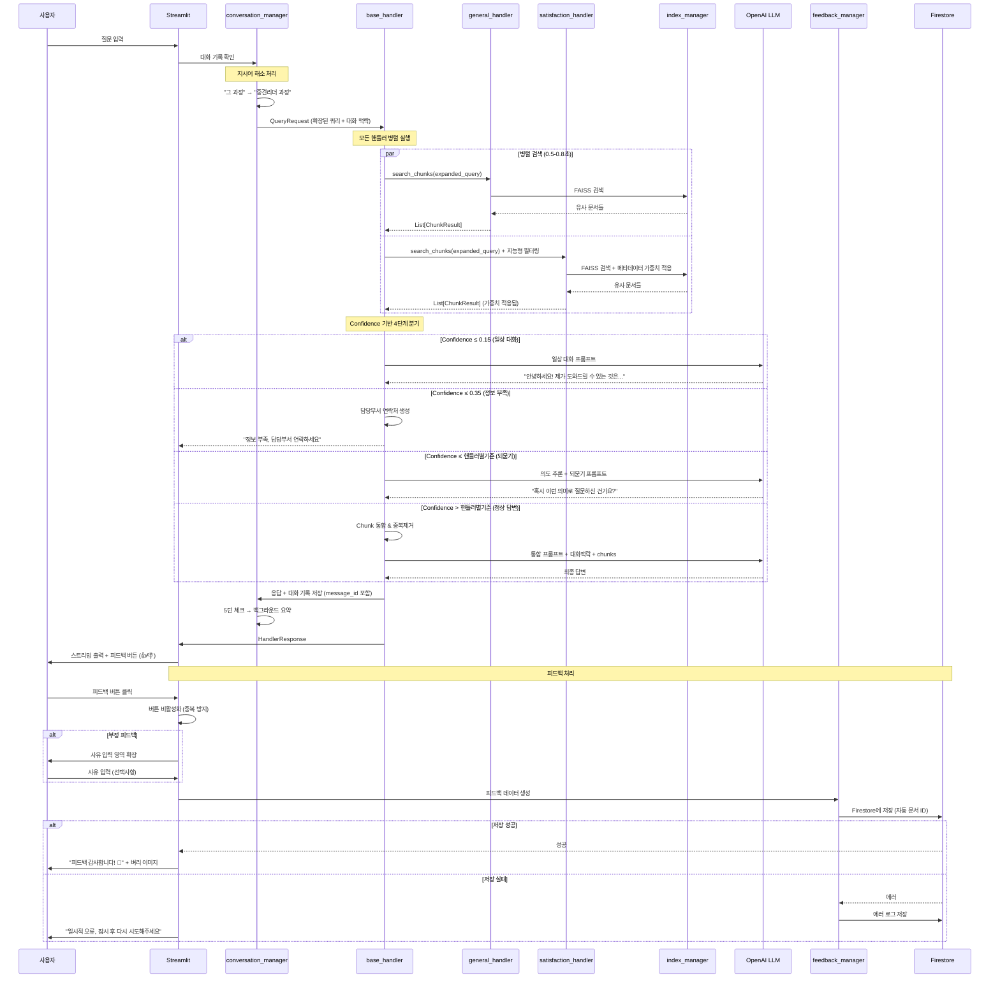

# BYEOLI_TALK_AT_GNHRD_app Architecture v4.0 (최종 완성본 + 지능형 필터링 시스템)

## 개요

경상남도인재개발원용 RAG 기반 대화형 챗봇으로, 챗봇의 이름은 "벼리(Byeoli)"이며, 다양한 내부 문서(교육계획, 만족도 조사, 학칙, 공지사항 등)를 기반으로 **인간 친화적 대화형 질의응답 서비스**를 제공합니다.

**핵심 설계 원칙**: 
- 모든 핸들러 병렬 실행 → chunk 수집 → 통합 LLM 호출
- **대화 맥락 유지** (5턴 슬라이딩 윈도우 + 백그라운드 요약)
- **지시어 해소** (자연스러운 대화)
- **Confidence 기반 4단계 분기** (일상 대화 + 되묻기)
- **단어 단위 스트리밍**
- **실시간 피드백 시스템** (Firestore 연동)
- **지능형 필터링 시스템** (사용자 경험 최적화)

## 전체 아키텍처

```mermaid
flowchart TD
    %% 데이터 레이어
    subgraph DATA["🗂️ 데이터 레이어"]
        D1[general/]
        D2[publish/]
        D3[satisfaction/]
        D4[cyber/]
        D5[menu/]
        D6[notice/]
    end
    
    %% 빌드타임 처리
    subgraph BUILD["🔨 빌드타임 처리"]
        M1[modules/loader_*.py]
        M2[utils/textifier.py]
        M3[utils/ocr_utils.py]
        M4[schemas/*.json 검증]
    end
    
    %% 벡터스토어
    subgraph VECTOR["📚 벡터스토어"]
        V1[vectorstore_general/]
        V2[vectorstore_publish/]
        V3[vectorstore_satisfaction/]
        V4[vectorstore_cyber/]
        V5[vectorstore_menu/]
        V6[vectorstore_notice/]
    end
    
    %% 런타임 엔진 - 대화형 구조
    subgraph RUNTIME["⚡ 런타임 엔진"]
        R1[index_manager<br/>싱글톤]
        R2[conversation_manager<br/>대화 관리 + 지시어 해소]
        R3[base_handler<br/>CentralOrchestrator]
        R4[병렬 핸들러 실행<br/>All Handlers]
        R5[Confidence 기반<br/>4단계 분기 처리]
        R6[통합 LLM 호출<br/>Single Call]
    end
    
    %% 핸들러 - 검색만 담당
    subgraph HANDLERS["🎯 핸들러 (검색 전용)"]
        H1[handle_general<br/>chunk 반환]
        H2[handle_publish<br/>chunk 반환]
        H3[handle_satisfaction<br/>chunk 반환 + 지능형 필터링]
        H4[handle_cyber<br/>chunk 반환 + 지능형 필터링]
        H5[handle_menu<br/>chunk 반환]
        H6[handle_notice<br/>chunk 반환]
    end
    
    %% 피드백 시스템
    subgraph FEEDBACK["📝 피드백 시스템"]
        F1[feedback_manager<br/>Firestore 연동]
        F2[실시간 데이터 수집]
        F3[관리자 대시보드<br/>24시간 캐시]
        F4[에러 로그 관리]
    end
    
    %% UI
    UI[🖥️ Streamlit UI<br/>스트리밍 + 대화형 + 피드백]
    
    DATA --> BUILD
    BUILD --> VECTOR
    VECTOR --> R1
    R1 --> R2
    R2 --> R3
    R3 --> R4
    R4 --> HANDLERS
    HANDLERS --> R5
    R5 --> R6
    R6 --> UI
    UI --> F1
    F1 --> F2
    F2 --> F3
    F3 --> F4
```



## 핵심 설계 변경점

### ❌ 기존 방식 (제거됨)
- Router 기반 핸들러 선택
- Top-2 핸들러만 실행
- 각 핸들러가 독립적으로 LLM 호출
- 단발성 질의응답 (대화 맥락 없음)
- 복잡한 context_manager.py
- 키워드 매칭 규칙

### ✅ 새로운 방식 (v4.0)
- **모든 핸들러 병렬 실행**: 6개 핸들러 동시 검색
- **Chunk 수집 방식**: 각 핸들러는 검색만 담당, LLM 호출 없음
- **통합 LLM 호출**: CentralOrchestrator에서 1회만 호출
- **대화형 시스템**: 5턴 슬라이딩 윈도우 + 백그라운드 요약
- **인간 친화적**: 지시어 해소 + confidence 기반 4단계 분기
- **단일 모듈**: conversation_manager.py로 대화 관리 통합
- **실시간 피드백**: Firestore 기반 피드백 수집 및 관리
- **지능형 필터링**: 도메인별 특화된 사용자 경험 최적화

## 🎯 **지능형 필터링 시스템 (신규 추가)**

### **설계 원칙**
Architecture.md의 "아름다운 코딩" 철학을 유지하면서도 사용자 경험을 향상시키는 지능형 필터링 시스템을 도입했습니다.

### **적용 기준**
- **사용자 경험 향상에 명확히 기여하는가?**
- **파인튜닝이 쉽게 가능한가?**
- **코드 가독성을 해치지 않는가?**

### **구현된 지능형 필터링**

#### **1. satisfaction_handler.py ✅ 완성**
**목적**: 높은 만족도 과정 우선 추천
```python
# 🔧 파인튜닝 설정 구역
HIGH_SATISFACTION_THRESHOLD = 4.60    # 높은/좋은 점수 기준
LOW_SATISFACTION_THRESHOLD = 4.15     # 낮은/좋지 못한 점수 기준
COURSE_TOP_RANKING_THRESHOLD = 50     # 교육과정 상위권 기준
SUBJECT_TOP_RANKING_THRESHOLD = 500   # 교과목 상위권 기준

# Confidence 가중치
TYPE_MATCH_BOOST = 0.03              # 타입 일치시 보너스
HIGH_SATISFACTION_BOOST = 0.05       # 높은 만족도 보너스
LOW_SATISFACTION_PENALTY = -0.03     # 낮은 만족도 페널티
```

**필터링 로직**:
- 쿼리 타입 분석: "교육과정" vs "교과목" 매칭
- 만족도 점수 기반 가중치: 4.60 이상 보너스, 4.15 이하 페널티
- 순위 기반 우선순위: 상위권 보너스, 하위권 페널티

#### **2. cyber_handler.py ✅ 완성**
**목적**: 바쁜 직장인을 위한 효율적 과정 추천
```python
# 🔧 파인튜닝 설정 구역
SHORT_LEARNING_THRESHOLD = 5.0      # 짧은 교육 기준
HIGH_EFFICIENCY_RATIO = 0.8         # 높은 효율성 기준
RECENT_DEVELOPMENT_THRESHOLD = 2023  # 최신 콘텐츠 기준

# Confidence 가중치
SHORT_LEARNING_BOOST = 0.04         # 짧은 학습시간 보너스 (가장 중요)
HIGH_EFFICIENCY_BOOST = 0.03        # 높은 인정시간 효율성 보너스
RECENT_CONTENT_BOOST = 0.02         # 최신 콘텐츠 보너스
EVALUATION_FREE_BOOST = 0.02        # 평가 없음 보너스

# 쿼리 의도 분석 키워드
PROFESSIONAL_KEYWORDS = ["전문", "심화", "자세한", "깊이", "상세한", "고급"]
CONVENIENCE_KEYWORDS = ["바쁜", "간단한", "짧은", "빠른", "쉬운", "기본"]
RECENT_KEYWORDS = ["최신", "신규", "새로운", "업데이트", "2024", "2025"]
```

**필터링 로직**:
- 플랫폼 매칭: "민간" → mingan 우선, "나라" → nara 우선
- 학습시간 최적화: 5시간 이하 과정 보너스
- 효율성 보너스: 인정시간/학습시간 비율 80% 이상
- 쿼리 의도 기반 동적 조정: 전문성 vs 편의성 vs 최신성

### **파인튜닝 편의성**
모든 지능형 필터링 설정은 각 핸들러 클래스 상단의 `🔧 파인튜닝 설정 구역`에 집중되어 있어 관리자가 쉽게 조정할 수 있습니다.
```python
# ================================================================
# 🔧 파인튜닝 설정 구역 - 여기서 모든 값 조정 가능
# ================================================================
[모든 임계값 및 가중치 설정]
# ================================================================
# 🔧 파인튜닝 설정 구역 끝
# ================================================================
```

## 데이터 구조

### ChunkResult 정의
```python
@dataclass
class ChunkResult:
    chunk: TextChunk           # 텍스트 청크 내용
    confidence: float          # 유사도 점수 (0.0-1.0)
    domain: str                # 도메인명 (satisfaction, general, etc.)
    search_method: str = "faiss"  # 검색 방법
    metadata: Dict[str, Any] = field(default_factory=dict)  # 확장 정보
```

### ConversationTurn 정의
```python
@dataclass
class ConversationTurn:
    user_message: str
    bot_response: str
    message_id: str = field(default_factory=lambda: str(uuid.uuid4()))  # 🆕 피드백 연결용
    timestamp: datetime
    confidence: float
    domain_used: List[str]
    feedback: Optional[FeedbackData] = None  # 🆕 피드백 데이터 연결
```

### FeedbackData 정의 (🆕 추가)
```python
@dataclass
class FeedbackData:
    conversation_id: str       # 어떤 대화 세션인지
    message_id: str           # 어떤 답변에 대한 피드백인지
    user_query: str           # 사용자 질문
    bot_response: str         # 챗봇 답변
    feedback_type: str        # "positive" | "negative"
    feedback_reason: Optional[str] = None  # 부정 피드백 사유
    timestamp: datetime = field(default_factory=datetime.now)
```

### 메타데이터 활용
```python
metadata = {
    "source_file": "course_satisfaction.csv",
    "department": "{부서명} {팀명}",
    "contact": "{전화번호}",
    "rank": 1,
    "search_score": 0.85
}
```
- general → 인재양성과 교육기획담당 (055-254-2051)
- satisfaction → 인재개발지원과 평가분석담당 (055-254-2021)
- cyber → 인재양성과 사이버담당 (055-254-2081)
- menu → 인재개발지원과 총무담당 (055-254-2096)
- notice → 경상남도인재개발원 대표번호 (055-254-2051)
- publish → 경상남도인재개발원 대표번호 (055-254-2051)

## 대화형 플로우

### 런타임 질의 플로우 (대화형 v4.0 + 피드백 + 지능형 필터링)


## Confidence 기반 4단계 분기 체계

### 설정 구조 (config/thresholds.py) - 확정됨
```python
# 공통 기준선 (모든 핸들러 공통)
COMMON_THRESHOLDS = {
    "casual_chat": 0.15,        # 0.0 ~ 0.15: 일상 대화
    "insufficient_info": 0.35   # 0.15초과 ~ 0.35: 정보 부족
}

# 핸들러별 개별 기준 (도메인 특성 반영)
HANDLER_THRESHOLDS = {
    "satisfaction": 0.45,  # 만족도: 정확성 중요 (엄격)
    "general": 0.42,       # 일반 정보: 관대
    "cyber": 0.48,         # 사이버교육: 기술적 정확성 (엄격)
    "menu": 0.40,          # 구내식당: 관대 (일상적 질문)
    "notice": 0.42,        # 공지사항: 적당히
    "publish": 0.45        # 발행물: 공식 문서 (엄격)
}
```

### Confidence 계산 공식 (확정)
```python
# 1. FAISS 거리 → 유사도 변환
similarity = 1.0 / (1.0 + distance)

# 2. 순위 기반 미세 조정 (최대 10% 영향)
rank_penalty = rank * 0.02  # 1등: 0, 2등: -0.02, 3등: -0.04
confidence = similarity - rank_penalty

# 3. 지능형 필터링 가중치 적용 (핸들러별)
confidence = apply_domain_specific_weights(confidence, metadata, query_intent)

# 4. 범위 제한
confidence = max(0.0, min(1.0, confidence))
```

### 처리 로직
```python
def determine_response_type(self, chunks):
    """최고 confidence chunk를 기준으로 응답 타입 결정"""
    if not chunks:
        return "casual_chat"
    
    # 최고 confidence chunk 찾기
    max_chunk = max(chunks, key=lambda x: x.confidence)
    max_confidence = max_chunk.confidence
    dominant_domain = max_chunk.domain
    
    # 4단계 분기 처리
    if max_confidence <= COMMON_THRESHOLDS["casual_chat"]:  # ≤ 0.15
        return "casual_chat"
    elif max_confidence <= COMMON_THRESHOLDS["insufficient_info"]:  # ≤ 0.35
        return "insufficient_info"
    elif max_confidence <= HANDLER_THRESHOLDS[dominant_domain]:  # ≤ 핸들러별기준
        return "clarification"
    else:  # > 핸들러별기준
        return "confident_answer"
```

## 핵심 혁신 기능

### 🚀 **인간 친화적 대화**
- **지시어 해소**: "그 과정" → "중견리더 과정"
- **맥락 유지**: 5턴 슬라이딩 윈도우 + 백그라운드 요약
- **자연스러운 대화**: 이전 대화 기반 연속적 응답

### 🎯 **Confidence 기반 4단계 지능형 분기**
- **일상 대화** (≤0.15): "벼리야 안녕" → 친근한 응답 + 서비스 소개
- **정보 부족** (0.15~0.35): 검색 실패 → 담당부서 연락처 제공
- **되묻기** (0.35~핸들러기준): 애매한 질문 → "혹시 이런 의미인가요?"
- **정상 답변** (핸들러기준 초과): 기존 RAG 방식

### 📝 **실시간 피드백 시스템** (🆕)
- **즉시 수집**: 👍👎 버튼으로 실시간 피드백
- **중복 방지**: 답변별 1회 피드백 제한
- **사유 수집**: 부정 피드백시 개선사항 수집 (선택사항)
- **Firestore 연동**: 안정적인 클라우드 저장
- **관리자 대시보드**: 실시간 통계 및 분석

### 🎯 **지능형 Confidence 시스템** (🆕 추가)
- **도메인별 특화 필터링**: 만족도는 품질 우선, 사이버교육은 편의성 우선
- **쿼리 의도 자동 감지**: "바쁜", "전문", "최신" 키워드로 사용자 니즈 파악
- **동적 가중치 조정**: 사용자 의도에 따라 실시간으로 필터링 기준 변경
- **파인튜닝 편의성**: 모든 설정값을 한 곳에서 쉽게 조정 가능

### ⚡ **성능 최적화**
- **병렬 검색**: 6개 핸들러 동시 실행
- **백그라운드 요약**: ThreadPoolExecutor로 응답 지연 없음
- **실시간 스트리밍**: 첫 토큰 1.5초 이내 출력
- **24시간 캐시**: 관리자 대시보드 성능 최적화

### 🔧 **관리 편의성**
- **설정 분리**: 임계값 쉽게 조정 가능 (thresholds.py)
- **핸들러별 설정**: 도메인 특성 반영 (만족도: 엄격, 식단: 관대)
- **실시간 모니터링**: 피드백 통계, 에러 로그, 성능 지표
- **CSV 내보내기**: 피드백 데이터 분석용 다운로드

## 실제 대화 시나리오 예시

### 시나리오 1: 자연스러운 대화 흐름 + 피드백
```
사용자: "2025년 중견리더 과정 만족도가 어때?"
벼리: "2025년 중견리더 과정 만족도는 종합 4.2점으로 우수한 편입니다. 기본역량 14.33%, 리더십역량 14.70%, 직무역량 24.64% 향상되었어요."
[👍👎 버튼 표시]

사용자: 👍 클릭
벼리: "피드백 감사합니다! 🙏 [벼리 이미지] 더 나은 서비스를 위해 소중한 의견 반영하겠습니다!"

사용자: "그 중에서 가장 높은 향상도를 보인 역량은?"  # 지시어 해소
벼리: "직무역량이 24.64%로 가장 높은 향상도를 보였습니다. 특히 기획력과 의사표현력 영역에서 큰 성과가 있었어요."
[👍👎 버튼 표시]

사용자: 👎 클릭
[사유 입력 영역 확장]
사용자: "더 구체적인 교과목별 분석이 필요해요" 입력 → 피드백 제출
벼리: "피드백 감사합니다! 🙏 [벼리 이미지] 더 나은 서비스를 위해 소중한 의견 반영하겠습니다!"
```

### 시나리오 2: 되묻기 기능 + 피드백
```
사용자: "교육 신청 어떻게 해?"  # 모호한 질문
벼리: "혹시 이런 의미로 질문하신 건가요?

1️⃣ 2025년 상반기 교육과정 신청 방법을 알고 싶으신가요?
2️⃣ 특정 교육과정(예: 리더십, 직무교육)의 신청 절차를 궁금해하시나요?
3️⃣ 온라인 신청 시스템 사용법을 알고 싶으신가요?

구체적으로 말씀해 주시면 정확한 안내를 해드릴게요!"
[👍👎 버튼 표시]

사용자: "2번이야. 리더십 교육 신청하고 싶어."
벼리: "리더십 교육 신청 방법을 안내해드릴게요! 현재 모집 중인 과정은..."
[👍👎 버튼 표시]
```

### 시나리오 3: 일상 대화 + 피드백
```
사용자: "벼리야 안녕!"
벼리: "안녕하세요! 벼리입니다 😊 오늘도 좋은 하루 보내고 계신가요? 무엇을 도와드릴까요?"
[👍👎 버튼 표시]

사용자: "너가 뭘 할 수 있어?"
벼리: "저는 경상남도인재개발원의 다양한 정보를 도와드릴 수 있어요!

📚 **교육과정 정보**: 리더십, 기본역량, 직무교육 과정 안내
📊 **만족도 분석**: 교육 성과 및 개선사항 정보
💻 **사이버교육**: 온라인 과정 안내 및 수강법
📢 **공지사항**: 최신 소식 및 중요 알림
🍽️ **구내식당**: 일일 메뉴 및 식단표
📖 **발행물**: 각종 자료 및 간행물 정보

궁금한 것이 있으시면 언제든 편하게 물어보세요!"
[👍👎 버튼 표시]
```

### 시나리오 4: 관리자 대시보드 사용
```
관리자: 사이드바에서 "관리자 비밀번호" 입력 → "byeoli2024"
[관리자 대시보드 화면 표시]

📊 통계:
- 총 피드백: 1,247건
- 좋아요: 1,089건 (87.3%)
- 싫어요: 158건 (12.7%)
- 만족도: 87.3%

📋 최근 피드백:
- 2024-12-20 15:30 | positive | "교육과정 정보가 정확해요"
- 2024-12-20 15:25 | negative | "사이버교육 안내가 부족해요
