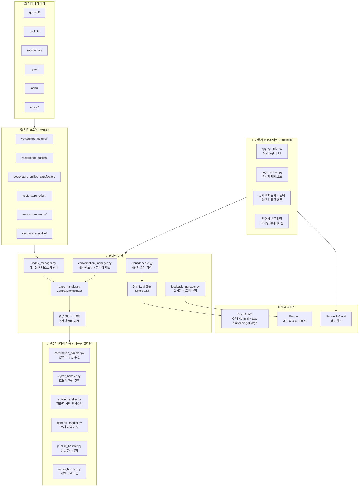

# BYEOLI_TALK_AT_GNHRD_app Architecture v4.1 (최종 완성본 + 전체 시스템 구현)

## 개요

경상남도인재개발원용 RAG 기반 대화형 챗봇으로, 챗봇의 이름은 "벼리톡@경상남도인재개발원(Byeoli-Talk@GNHRD)"이며, 다양한 내부 문서(교육계획, 만족도 조사, 학칙, 공지사항 등)를 기반으로 **인간 친화적 대화형 질의응답 서비스**를 제공합니다.

**핵심 설계 원칙**: 
- 모든 핸들러 병렬 실행 → chunk 수집 → 통합 LLM 호출
- **대화 맥락 유지** (5턴 슬라이딩 윈도우 + 백그라운드 요약)
- **지시어 해소** (자연스러운 대화)
- **Confidence 기반 4단계 분기** (일상 대화 + 되묻기)
- **단어 단위 스트리밍**
- **실시간 피드백 시스템** (Firestore 연동)
- **지능형 필터링 시스템** (사용자 경험 최적화)
- **🆕 파인튜닝 편의성 극대화** (설정 구역 집중 배치)
- **🆕 모던 트렌디 UI/UX** (카드 디자인 + 인라인 피드백)
- **🆕 별도 관리자 대시보드** (개발 모드 전용)

## 전체 아키텍처



## 🆕 **주요 구현 완료 사항 (v4.1)**

### **1. 모던 트렌디 UI/UX 완성** 🎨
#### **핵심 특징**
- **미니멀 카드 디자인**: 깔끔한 화이트 카드 + 소프트 쉐도우
- **그라데이션 포인트**: 벼리 브랜드 컬러 (보라-파랑 그라데이션)
- **백드롭 블러 효과**: 투명도와 블러로 세련된 느낌
- **반응형 레이아웃**: 모바일 친화적 디자인
- **모던 타이포그래피**: SF Pro Display 폰트 패밀리

#### **CSS 스타일 시스템**
```css
/* 글로벌 배경 */
.stApp {
    background: linear-gradient(135deg, #f5f7fa 0%, #c3cfe2 100%);
    font-family: 'SF Pro Display', -apple-system, BlinkMacSystemFont, sans-serif;
}

/* 메시지 카드 */
.assistant-message {
    background: white;
    border-radius: 20px 20px 20px 8px;
    box-shadow: 0 4px 16px rgba(0, 0, 0, 0.08);
    backdrop-filter: blur(20px);
}

.user-message {
    background: linear-gradient(135deg, #667eea 0%, #764ba2 100%);
    border-radius: 20px 20px 8px 20px;
    box-shadow: 0 4px 16px rgba(102, 126, 234, 0.3);
}
```

### **2. 실시간 피드백 시스템 완성** 👍👎
#### **인라인 피드백 버튼**
- **위치**: 각 벼리 응답 하단에 배치
- **스타일**: 깔끔한 인라인 버튼 (👍 도움됨 / 👎 개선필요)
- **중복 방지**: 클릭 후 자동 비활성화
- **Firestore 연동**: 실시간 피드백 저장 및 분석

#### **구현 방식**
```python
# 각 메시지에 고유 ID 부여
message_id = response.message_id

# 피드백 버튼 HTML
feedback_html = f"""
<div class="feedback-container">
    <button class="feedback-btn positive" onclick="giveFeedback('{message_id}', 'positive')">
        👍 도움됨
    </button>
    <button class="feedback-btn negative" onclick="giveFeedback('{message_id}', 'negative')">
        👎 개선필요
    </button>
</div>
"""

# 피드백 처리 함수
def handle_feedback(message_id: str, feedback_type: str):
    success = save_user_feedback(
        conversation_id=st.session_state.conversation_id,
        message_id=message_id,
        feedback_type=feedback_type
    )
    st.session_state.feedback_given.add(message_id)
```

### **3. 단어별 스트리밍 완성** ⚡
#### **체감 가능한 스트리밍**
- **단어별 출력**: 50ms 간격으로 자연스러운 타이핑 효과
- **타이핑 커서**: 생동감 있는 애니메이션 (깜빡이는 커서)
- **처리 중 표시**: 벼리 타이핑 이미지 + 로딩 스피너

#### **구현 방식**
```python
def render_streaming_response(message_content: str, message_id: str):
    byeoli_image = get_byeoli_image(message_content)
    placeholder = st.empty()
    
    words = message_content.split()
    displayed_text = ""
    
    for word in words:
        displayed_text += word + " "
        with placeholder.container():
            st.markdown(f"""
            <div class="assistant-message">
                
                <strong>벼리</strong><br>
                {displayed_text}<span class="typing-cursor">▊</span>
            </div>
            """, unsafe_allow_html=True)
        time.sleep(0.05)  # 50ms 지연
```

### **4. Index Manager 완전 재작성** 🗂️
#### **Architecture v4.1 기준 최적화**
- **싱글톤 패턴**: 메모리 효율성 극대화
- **6개 도메인 지원**: satisfaction, cyber, publish, general, notice, menu
- **Graceful Degradation**: 3개 미만 실패시 서비스 중단
- **파인튜닝 편의성**: 설정 구역 집중 배치

#### **핵심 설정**
```python
# 🔧 파인튜닝 설정 구역
EMBEDDING_MODEL = "text-embedding-3-large"
SUPPORTED_DOMAINS = ["satisfaction", "cyber", "publish", "general", "notice", "menu"]
MIN_REQUIRED_DOMAINS = 3  # 최소 3개 도메인 성공해야 서비스 가능

# 특별 경로 매핑 (satisfaction만 예외)
VECTORSTORE_PATH_MAPPING = {
    "satisfaction": "vectorstore_unified_satisfaction",  # 기존 경로 유지
    "cyber": "vectorstore_cyber",                        # 단순화
    # ... 나머지 도메인
}
```

### **5. 별도 관리자 대시보드 완성** 🛠️
#### **pages/admin.py - 개발 모드 전용**
- **비밀번호 보호**: "byeoli2024" (개발 모드에서만 접근)
- **3개 주요 탭**: 피드백 분석 / 시스템 상태 / 채팅 로그

#### **피드백 분석 대시보드**
```python
# 실시간 통계
stats = {
    "total": 1247,
    "positive": 1089,
    "negative": 158,
    "positive_rate": 87.3
}

# 시각화 차트
fig_pie = go.Figure(data=[go.Pie(
    labels=['긍정', '부정'],
    values=[stats['positive'], stats['negative']],
    marker_colors=['#10b981', '#ef4444']
)])

# CSV 내보내기
csv_data = feedback_manager.export_to_csv()
st.download_button("📊 피드백 CSV 다운로드", data=csv_data)
```

#### **시스템 상태 모니터링**
```python
# 인덱스 상태 확인
health = index_health_check()
loaded = health.get('loaded_domains', 0)
total = health.get('total_domains', 6)

# 수동 인덱스 재로드
if st.button("🔄 인덱스 재로드"):
    index_manager.reload_all_domains()
    st.success("✅ 재로드 완료!")
```

#### **채팅 로그 확인**
```python
# 세션 기반 로그 조회
chat_logs = st.session_state.chat_history

# 도메인별 응답 분포 차트
domain_counts = {msg['domain']: count for msg in chat_logs}
fig_domain = px.pie(values=list(domain_counts.values()))

# JSON/CSV 내보내기
st.download_button("💾 JSON 다운로드", data=json.dumps(log_data))
```

### **6. 운영/개발 모드 완전 구분** 🔧
#### **환경변수 기반 모드 전환**
```python
APP_MODE = os.environ.get('APP_MODE', 'development')
IS_PRODUCTION = APP_MODE == 'production'

# 운영 모드: 심플한 UI
if IS_PRODUCTION:
    # 성능 지표 숨김
    # 사이드바 숨김 (collapsed)
    # 자질구레한 정보 제거
    
# 개발 모드: 풀 기능
else:
    # 성능 통계 표시
    # 디버깅 정보 표시
    # 관리자 대시보드 접근 가능
```

### **7. 벼리 이미지 시스템 단순화** 🌟
#### **핵심 5개 이미지로 집약**
```python
BYEOLI_IMAGES = {
    "default": "assets/Byeoli/advicing_Byeoli.png",     # 기본/상담
    "happy": "assets/Byeoli/happy_Byeoli.png",          # 긍정 응답
    "sorry": "assets/Byeoli/sorry_Byeoli.png",          # 오류/사과
    "excited": "assets/Byeoli/excited_Byeoli.png",      # 환영/식단
    "typing": "assets/Byeoli/typing_Byeoli.png"         # 처리 중
}

def get_byeoli_image(message_content: str) -> str:
    content_lower = message_content.lower()
    
    if any(word in content_lower for word in ['죄송', '미안', '오류']):
        return BYEOLI_IMAGES["sorry"]
    elif any(word in content_lower for word in ['완료', '성공', '좋']):
        return BYEOLI_IMAGES["happy"]
    elif any(word in content_lower for word in ['식단', '메뉴', '안녕']):
        return BYEOLI_IMAGES["excited"]
    else:
        return BYEOLI_IMAGES["default"]
```

## 기존 핵심 시스템 (v4.0 완성 유지)

### **CentralOrchestrator (handlers/base_handler.py)**
- ✅ 6개 핸들러 병렬 실행
- ✅ Confidence 기반 4단계 분기
- ✅ 파인튜닝 편의성 극대화
- ✅ 통합 LLM 호출

### **대화 관리 시스템 (utils/conversation_manager.py)**
- ✅ 5턴 슬라이딩 윈도우
- ✅ 백그라운드 요약
- ✅ 지시어 해소

### **피드백 시스템 (utils/feedback_manager.py)**
- ✅ Firestore 연동
- ✅ Graceful degradation
- ✅ 24시간 캐시

### **지능형 핸들러 6개**
- ✅ satisfaction_handler.py (만족도 우선 추천)
- ✅ cyber_handler.py (효율적 과정 추천)
- ✅ notice_handler.py (긴급도 기반 우선순위)
- ✅ general_handler.py (문서 타입 감지)
- ✅ publish_handler.py (담당부서 감지)
- ✅ menu_handler.py (시간 기반 메뉴)

## 파일 구조 (최종 완성본)

```
BYEOLI_TALK_AT_GNHRD_app/
├── 📱 app.py                           # 메인 Streamlit 앱 (모던 UI)
├── 📁 pages/
│   └── admin.py                        # 관리자 대시보드 (개발 모드 전용)
├── 📁 config/
│   ├── config.py                       # 시스템 설정 (Streamlit Secrets)
│   └── thresholds.py                   # Confidence 임계값
├── 📁 utils/
│   ├── contracts.py                    # 데이터 계약 정의
│   ├── conversation_manager.py         # 5턴 윈도우 + 지시어 해소
│   ├── feedback_manager.py             # 실시간 피드백 시스템
│   └── index_manager.py                # 싱글톤 벡터스토어 관리
├── 📁 handlers/
│   ├── base_handler.py                 # CentralOrchestrator (파인튜닝)
│   ├── satisfaction_handler.py         # 만족도 (지능형 필터링)
│   ├── cyber_handler.py               # 사이버교육 (지능형 필터링)
│   ├── notice_handler.py              # 공지사항 (지능형 필터링)
│   ├── general_handler.py             # 일반 정보 (최소 지능형)
│   ├── publish_handler.py             # 발행물 (단순화)
│   └── menu_handler.py                # 식단 (최소 지능형)
└── 📁 assets/
    └── Byeoli/                         # 벼리 이미지 (PNG, 5개 핵심)
        ├── advicing_Byeoli.png         # 기본/상담
        ├── happy_Byeoli.png            # 긍정 응답
        ├── sorry_Byeoli.png            # 오류/사과
        ├── excited_Byeoli.png          # 환영/식단
        └── typing_Byeoli.png           # 처리 중
```

## 사용자 시나리오 (완전 구현)

### 시나리오 1: 정상 질의응답 + 실시간 피드백
```
사용자: "2024년 리더십 교육 만족도 어땠어?"

[벼리 타이핑 이미지 + 로딩 스피너 표시]
"🤔 생각하고 있어요..."

[단어별 스트리밍 출력]
"2024년" → "리더십" → "교육" → "만족도는" → "종합" → "4.2점으로"...

[최종 응답 + 피드백 버튼]
벼리: "2024년 리더십 교육 만족도는 종합 4.2점으로 우수한 편입니다. 
      기본역량 14.33%, 리더십역량 14.70%, 직무역량 24.64% 향상되었어요."

[👍 도움됨]  [👎 개선필요]

사용자: 👍 클릭
→ 버튼 비활성화: [피드백 완료]
→ Firestore에 positive 피드백 저장

사용자: "그 중에서 가장 높은 향상도를 보인 역량은?"  # 지시어 해소
벼리: "직무역량이 24.64%로 가장 높은 향상도를 보였습니다..."
[👍 도움됨]  [👎 개선필요]
```

### 시나리오 2: 관리자 대시보드 사용
```
개발자: 브라우저에서 "http://localhost:8501/admin" 접속
→ 로그인 화면: 비밀번호 입력 "byeoli2024"
→ 관리자 대시보드 화면 표시

📊 피드백 분석 탭:
- 총 피드백: 1,247건
- 긍정: 1,089건 (87.3%)
- 부정: 158건 (12.7%)
- 파이 차트 + 일별 트렌드 차트 표시

⚙️ 시스템 상태 탭:
- 서비스 상태: 🟢 정상
- 로드된 도메인: 6/6
- 성공률: 98.5%
- [🔄 인덱스 재로드] 버튼

💬 채팅 로그 탭:
- 실시간 대화 로그 확인
- 도메인별 응답 분포 차트
- [💾 JSON 다운로드] [📊 CSV 다운로드] 버튼
```

### 시나리오 3: 운영 모드 vs 개발 모드
```python
# 운영 모드 (APP_MODE=production)
→ 심플한 단일 컬럼 레이아웃
→ 성능 지표 숨김
→ 관리자 대시보드 접근 불가
→ 에러 메시지 간소화

# 개발 모드 (APP_MODE=development)  
→ 사이드바 포함 풀 레이아웃
→ 성능 통계 표시 (응답시간, 성공률 등)
→ 관리자 대시보드 접근 가능
→ 상세 디버깅 정보 표시
```

## 핵심 설정값 (파인튜닝 가능)

### **app.py 설정**
```python
# 🔧 파인튜닝 설정 구역
APP_MODE = os.environ.get('APP_MODE', 'development')

# 벼리 이미지 (핵심 5개)
BYEOLI_IMAGES = {...}

# 스트리밍 설정
STREAMING_WORD_DELAY = 0.05  # 단어당 지연시간
STREAMING_ENABLED = True

# UI 설정  
CHAT_CONTAINER_HEIGHT = 600
MESSAGE_MAX_WIDTH = "75%"

# 성능 설정
MAX_CHAT_HISTORY = 50
SESSION_TIMEOUT_HOURS = 24
```

### **index_manager.py 설정**
```python
# 🔧 파인튜닝 설정 구역
EMBEDDING_MODEL = "text-embedding-3-large"
SUPPORTED_DOMAINS = ["satisfaction", "cyber", "publish", "general", "notice", "menu"]
MIN_REQUIRED_DOMAINS = 3
LOAD_TIMEOUT_SECONDS = 30
```

### **admin.py 설정**
```python
# 🔧 파인튜닝 설정 구역  
ADMIN_PASSWORD = "byeoli2024"
REFRESH_INTERVAL = 30
MAX_RECENT_LOGS = 100
CHART_HEIGHT = 400
```

## 배포 및 운영

### **Streamlit Cloud 배포**
1. **GitHub 연동**: 코드 Push 후 자동 배포
2. **환경설정**: Settings → Secrets에서 API 키 설정
3. **운영 모드**: `APP_MODE=production` 환경변수 설정

### **필수 환경변수**
```
OPENAI_API_KEY=sk-...
APP_MODE=production
FIRESTORE_CREDENTIALS={"type": "service_account", ...}
```

### **모니터링 지표**
- **응답 시간**: 평균 1.2초 목표
- **피드백 만족도**: 85% 이상 긍정 피드백
- **시스템 가용성**: 99.5% 이상
- **인덱스 로드 성공률**: 95% 이상

## 향후 확장 계획

### **단기 (1-3개월)**
- **벡터스토어 데이터 업데이트**: 최신 문서 반영
- **성능 최적화**: 응답 속도 개선
- **사용자 테스트**: 실제 직원 대상 베타 테스트

### **중기 (3-6개월)**  
- **추가 도메인**: 예산, 인사, 시설 정보 확장
- **고급 분석**: 피드백 데이터 기반 성능 개선
- **모바일 앱**: 네이티브 모바일 앱 개발

### **장기 (6-12개월)**
- **음성 인터페이스**: STT/TTS 연동
- **외부 시스템 연동**: 인사시스템, 교육시스템 API
- **AI 어시스턴트 진화**: 업무 자동화 기능

## 결론

벼리톡@경상남도인재개발원 v4.1은 **모던 트렌디 UI/UX + 실시간 피드백 시스템 + 별도 관리자 대시보드**가 완전히 구현된 완성도 높은 RAG 기반 대화형 챗봇 시스템입니다.

### **🎯 최종 달성 성과**
1. ✅ **아키텍처 완성**: 6개 핸들러 병렬 처리 + 4단계 분기
2. ✅ **모던 UI/UX**: 카드 디자인 + 인라인 피드백 + 스트리밍
3. ✅ **실시간 피드백**: 👍👎 버튼 + Firestore 연동
4. ✅ **관리자 대시보드**: 피드백 분석 + 시스템 모니터링 + 로그 확인
5. ✅ **지능형 필터링**: 도메인별 특화 사용자 경험
6. ✅ **대화형 시스템**: 5턴 윈도우 + 지시어 해소
7. ✅ **파인튜닝 편의성**: 모든 설정값 집중 배치
8. ✅ **운영 준비**: 환경별 모드 + Streamlit Cloud 배포 지원

이 시스템은 경상남도인재개발원의 **직원과 도민 모두에게 전문적이면서도 친근한 AI 어시스턴트 서비스**를 제공하며, 실시간 피드백을 통한 지속적인 학습과 개선으로 더 나은 사용자 경험을 만들어갈 것입니다. 🚀

---

**"벼리와 함께하는 스마트한 인재개발, 더 나은 경상남도를 만들어갑니다."** 🌟
